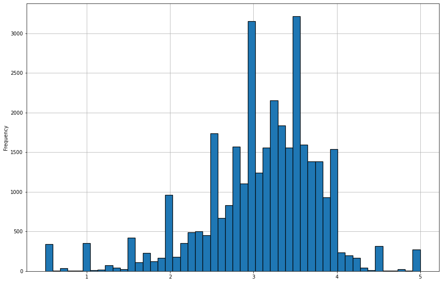

# Recommendation_Engine
attempt to mimic a netflix style recommendation engine using Pandas

The dataset used to learn the various movie preferences can be downloaded from the following link:

https://grouplens.org/datasets/movielens/

I have implemented a recommendation engine as both Collaborative Recommendation and Content-Based.

Collaborative Recommendation Engine EDA:

Following is the distribution of movies by year, we see that there are most of the movies in our dataset were released between 2000 and 2016. The movies database ofcourse has to be updated to include the years after the latest in the dataset till current year.

We see from the following distribution that most users have rated the movies between 3.0 and 4.0. 

