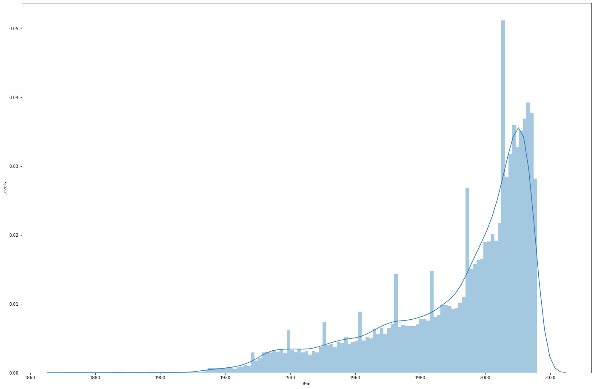

# Recommendation_Engine
attempt to mimic a netflix style recommendation engine using Pandas

The dataset used to learn the various movie preferences can be downloaded from the following link:

https://grouplens.org/datasets/movielens/

I have implemented a recommendation engine as both Collaborative Recommendation and Content-Based.

Collaborative Recommendation Engine EDA:

